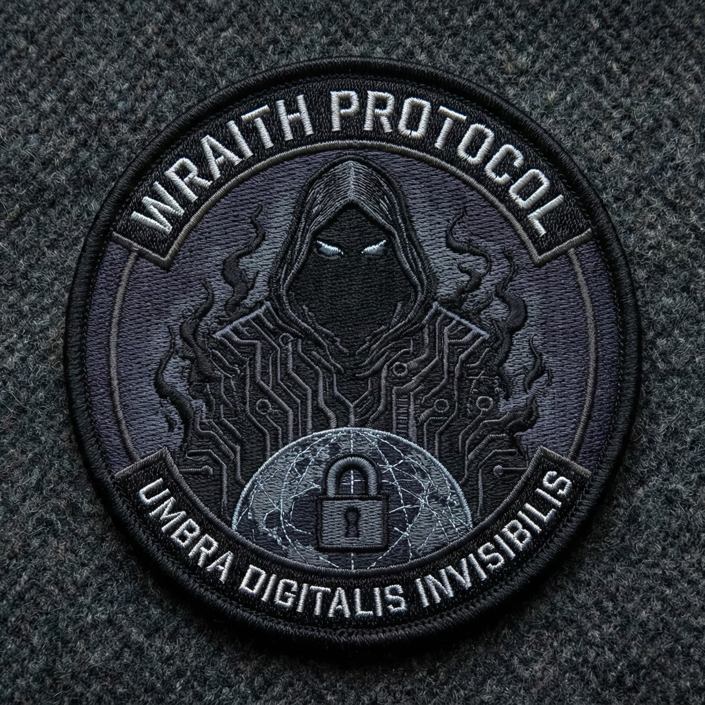

# WRAITH Protocol

**W**ire-speed **R**esilient **A**uthenticated **I**nvisible **T**ransfer **H**andler

A decentralized secure file transfer protocol optimized for high-throughput, low-latency operation with strong security guarantees and traffic analysis resistance.

<p align="center">
  
</p>

[](https://github.com/doublegate/WRAITH-Protocol/actions/workflows/ci.yml)
[](https://github.com/doublegate/WRAITH-Protocol/actions/workflows/codeql.yml)
[](https://github.com/doublegate/WRAITH-Protocol/actions/workflows/release.yml)
[](https://github.com/doublegate/WRAITH-Protocol/releases)
[](docs/security/SECURITY_AUDIT_v1.1.0.md)
[](https://www.rust-lang.org/)
[](https://doc.rust-lang.org/edition-guide/rust-2024/index.html)
[](LICENSE)

---

## Overview

WRAITH Protocol is a privacy-focused, high-performance file transfer protocol designed for secure peer-to-peer communication. Built in Rust, it combines kernel-bypass networking with modern cryptography to deliver:

- **Wire-speed transfers** - 10+ Gbps with AF_XDP kernel bypass, sub-millisecond latency
- **End-to-end encryption** - Noise_XX handshake, XChaCha20-Poly1305, perfect forward secrecy
- **Traffic analysis resistance** - Elligator2 key encoding, protocol mimicry, cover traffic
- **Decentralized discovery** - Kademlia DHT, NAT traversal, relay fallback
- **Production-ready ecosystem** - 9 desktop client applications for file transfer, messaging, and specialized use cases

### Project Metrics

| Metric | Value |
|--------|-------|
| **Tests** | 2,124+ passing (99.2% pass rate, 16 intentionally ignored) |
| **Code** | ~272,000 lines Rust (protocol + clients) + ~10,000 lines TypeScript |
| **Documentation** | 130+ files, ~90,000+ lines |
| **Security** | Grade A+ (zero vulnerabilities, 295 audited dependencies) |
| **Quality** | 98/100, zero clippy warnings |
| **TDR** | ~2.5% (Grade A - Excellent) |
| **Applications** | 9 production-ready desktop clients |


---

## Features

### High-Performance Transport

- Wire-speed transfers (10+ Gbps with AF_XDP kernel bypass)
- Sub-millisecond latency (<1ms packet processing with io_uring)
- Zero-copy I/O via AF_XDP UMEM and io_uring registered buffers
- BBR congestion control with optimal bandwidth utilization
- Async file I/O with io_uring

### Security and Privacy

- End-to-end encryption (XChaCha20-Poly1305 AEAD)
- Perfect forward secrecy (Double Ratchet with DH and symmetric ratcheting)
- Mutual authentication (Noise_XX handshake pattern)
- Ed25519 digital signatures for identity verification
- BLAKE3 cryptographic hashing
- Traffic analysis resistance (Elligator2 key encoding)
- Replay protection (64-bit sliding window)
- Key commitment for AEAD (prevents multi-key attacks)

### Traffic Obfuscation

- Packet padding (PowerOfTwo, SizeClasses, ConstantRate, Statistical modes)
- Timing obfuscation (Fixed, Uniform, Normal, Exponential distributions)
- Protocol mimicry (TLS 1.3, WebSocket, DNS-over-HTTPS)
- Cover traffic generation (Constant, Poisson, Uniform distributions)
- Adaptive threat-level profiles (Low, Medium, High, Paranoid)

### Decentralized Discovery

- Privacy-enhanced Kademlia DHT with BLAKE3 NodeIds
- S/Kademlia Sybil resistance (crypto puzzle-based NodeId generation)
- NAT traversal (STUN client, ICE-lite UDP hole punching)
- DERP-style relay infrastructure with automatic fallback
- Connection migration with PATH_CHALLENGE/PATH_RESPONSE

### File Transfer

- Chunked file transfer with BLAKE3 tree hashing
- Multi-peer downloads with parallel chunk fetching
- Resume support with missing chunks detection
- Real-time progress tracking (bytes, speed, ETA)
- Chunk verification (<1us per chunk)


---

## History

WRAITH Protocol draws inspiration from the rich history of network reconnaissance, tracing a lineage from the analog telephone era to modern internet-scale discovery.

### The Wardialing Era (1980s-1990s)

In the formative decades of the digital age, the Public Switched Telephone Network (PSTN) was the primary gateway to computer systems. **Wardialing**—the systematic automated dialing of telephone numbers to identify responding modems—became the foundational reconnaissance technique. The 1980 release of Zoom Telephonics' **Demon Dialer** introduced automated dialing to consumers, while the 1983 film *WarGames* popularized the technique and directly influenced national security policy, leading to NSDD-145 and the modern information security state.

Tools like **ToneLoc** (1990s) pioneered randomized dialing to evade detection, while **THC-Scan** added European PBX support. The commercial **PhoneSweep** (1998) legitimized wardialing as a professional security audit practice, with banner fingerprinting databases identifying over 470 system types.

### The Digital Evolution (2000s-Present)

As dial-up faded, the wardialing philosophy migrated to new mediums. **Wardriving** applied the same brute-force discovery to Wi-Fi networks. **WarVOX** (2009) leveraged VoIP and audio fingerprinting for cloud-scale telephone scanning. Today, stateless scanners like **Masscan** can enumerate the entire IPv4 address space in minutes, while **Shodan** continuously indexes every internet-connected device—the ultimate evolution of reconnaissance from the 10,000-number telephone exchange to the 4.3 billion-address IPv4 space.

WRAITH Protocol embodies this evolution: the same philosophy of systematic discovery and secure communication, implemented with modern cryptography and kernel-bypass networking for the contemporary threat landscape.

*For the complete history of automated reconnaissance from the Demon Dialer to Shodan, see [The Dial-Up Frontier](ref-docs/Wardialing_Then-Now_History.md).*


---

## Client Applications

WRAITH Protocol powers a comprehensive ecosystem of 9 production-ready desktop applications:

### Tier 1: Core Applications

| Application | Platform | Description |
|-------------|----------|-------------|
| **[WRAITH-Transfer](clients/wraith-transfer/)** | Desktop | Secure P2P file transfer with drag-and-drop GUI |
| **[WRAITH-Chat](clients/wraith-chat/)** | Desktop | E2EE messaging with voice/video calls and group messaging |

### Tier 2: Specialized Applications

| Application | Platform | Description |
|-------------|----------|-------------|
| **[WRAITH-Sync](clients/wraith-sync/)** | Desktop | Serverless file synchronization with delta transfers and version history |
| **[WRAITH-Share](clients/wraith-share/)** | Desktop | Anonymous distributed file sharing with swarm transfers |
| **[WRAITH-Stream](clients/wraith-stream/)** | Desktop | Secure media streaming with AV1/VP9/H.264 and adaptive bitrate |

### Tier 3: Advanced Applications

| Application | Platform | Description |
|-------------|----------|-------------|
| **[WRAITH-Mesh](clients/wraith-mesh/)** | Desktop | IoT mesh networking with topology visualization and diagnostics |
| **[WRAITH-Publish](clients/wraith-publish/)** | Desktop | Censorship-resistant content publishing with Ed25519 signatures and RSS |
| **[WRAITH-Vault](clients/wraith-vault/)** | Desktop | Distributed secret storage with Shamir's Secret Sharing |
| **[WRAITH-Recon](clients/wraith-recon/)** | Desktop | Network reconnaissance platform for authorized security testing (RoE enforced) |

### Application Highlights

**WRAITH-Chat** features:
- Signal Protocol Double Ratchet (forward secrecy + post-compromise security)
- Voice calling with Opus codec and RNNoise noise suppression
- Video calling with VP8/VP9 and adaptive bitrate (360p-1080p)
- Group messaging with Sender Keys protocol for O(1) encryption
- SQLCipher encrypted local database

**WRAITH-Vault** features:
- Shamir's Secret Sharing with configurable k-of-n threshold
- Guardian-based key fragment distribution
- Erasure coding (Reed-Solomon) for redundancy
- AES-256-GCM encrypted backups with zstd compression
- Scheduled automatic backups

**WRAITH-Recon** features (authorized security testing only):
- Rules of Engagement (RoE) enforcement with Ed25519 signatures
- Passive reconnaissance with AF_XDP kernel-bypass capture (10-40 Gbps)
- Covert channel testing (DNS tunneling, ICMP steganography, TLS mimicry)
- Tamper-evident audit logging with MITRE ATT&CK mapping
- Kill switch with <1ms activation latency

For detailed client documentation, see the [Client Overview](docs/clients/overview.md).

---

## Quick Start

### Installation

**Pre-built Binaries** (recommended):

Download from the [releases page](https://github.com/doublegate/WRAITH-Protocol/releases):

| Platform | Architecture | Notes |
|----------|--------------|-------|
| Linux | x86_64, aarch64 | glibc and musl variants |
| macOS | x86_64, aarch64 | Intel and Apple Silicon |
| Windows | x86_64 | - |

```bash
# Linux/macOS
tar xzf wraith-<platform>.tar.gz
chmod +x wraith
./wraith --version

# Windows (PowerShell)
Expand-Archive wraith-x86_64-windows.zip
.\wraith.exe --version
```

**Build from Source:**

```bash
git clone https://github.com/doublegate/WRAITH-Protocol.git
cd WRAITH-Protocol

cargo build --release
cargo test --workspace

./target/release/wraith --version
```

**Requirements:**
- Rust 1.85+ (Rust 2024 edition)
- Linux 6.2+ recommended (for AF_XDP and io_uring)
- x86_64 or aarch64 architecture

### Basic Usage

```bash
# Generate identity keypair
wraith keygen --output ~/.wraith/identity.key

# Send a file to peer
wraith send document.pdf <peer-id>

# Receive files
wraith receive --output ./downloads

# Run as background daemon
wraith daemon --bind 0.0.0.0:0

# Check node status
wraith status

# List discovered peers
wraith peers

# View configuration
wraith config --show
```

For detailed usage, see the [User Guide](docs/USER_GUIDE.md) and [Tutorial](docs/TUTORIAL.md).

---

## Architecture

WRAITH Protocol uses a six-layer design optimized for security and performance:

```
   Application Layer          File transfer, chunking, integrity
         |
   Session Layer              Stream mux, flow control, BBR congestion
         |
   Crypto Transport           Noise_XX, XChaCha20-Poly1305, ratcheting
         |
   Obfuscation Layer          Elligator2, padding, timing jitter
         |
   Kernel Acceleration        AF_XDP, io_uring, zero-copy DMA
         |
   Network Layer              UDP, raw sockets, covert channels
```

### Protocol Crates

| Crate | Description | Tests |
|-------|-------------|-------|
| **wraith-core** | Frame parsing (SIMD), sessions, congestion control, Node API | 414 |
| **wraith-crypto** | Ed25519, X25519+Elligator2, AEAD, Noise_XX, Double Ratchet | 127 |
| **wraith-transport** | AF_XDP, io_uring, UDP sockets, worker pools | 130 |
| **wraith-obfuscation** | Padding, timing, cover traffic, protocol mimicry | 111 |
| **wraith-discovery** | Kademlia DHT, STUN, ICE, relay infrastructure | 231 |
| **wraith-files** | File chunking, BLAKE3 tree hashing, io_uring I/O | 34 |
| **wraith-cli** | Command-line interface with Node API integration | 8 |
| **wraith-ffi** | Foreign function interface (C/JNI bindings) | 6 |

For detailed architecture documentation, see [Protocol Overview](docs/architecture/protocol-overview.md).

---

## Performance

### Targets

| Metric | Target | Notes |
|--------|--------|-------|
| Throughput (10 GbE) | >9 Gbps | AF_XDP with zero-copy |
| Throughput (1 GbE) | >950 Mbps | With encryption |
| Handshake Latency | <50 ms | LAN conditions |
| Packet Latency | <1 ms | NIC to application |
| Memory per Session | <10 MB | Including buffers |
| CPU @ 10 Gbps | <50% | 8-core system |

### Benchmarks

| Component | Measured Performance |
|-----------|---------------------|
| Ring Buffers | ~100M ops/sec (SPSC), ~20M ops/sec (MPSC) |
| Frame Parsing | 172M frames/sec (SIMD: AVX2/SSE4.2/NEON) |
| AEAD Encryption | 3.2 GB/s (XChaCha20-Poly1305) |
| BLAKE3 Hashing | 8.5 GB/s (parallelized) |
| File Chunking | 14.85 GiB/s |
| Tree Hashing | 4.71 GiB/s in-memory |
| Chunk Verification | 4.78 GiB/s |
| File Reassembly | 5.42 GiB/s |

---

## Security

### Cryptographic Suite

| Function | Algorithm | Security Level |
|----------|-----------|----------------|
| Signatures | Ed25519 | 128-bit |
| Key Exchange | X25519 | 128-bit |
| Key Encoding | Elligator2 | Traffic analysis resistant |
| AEAD | XChaCha20-Poly1305 | 256-bit key, 192-bit nonce |
| Hash | BLAKE3 | 128-bit collision resistance |
| KDF | HKDF-BLAKE3 | 128-bit |
| Handshake | Noise_XX | Mutual auth, identity hiding |
| Ratcheting | Double Ratchet | Forward + post-compromise security |

### Security Features

**Cryptographic Guarantees:**
- Forward secrecy via Double Ratchet
- Post-compromise security via DH ratchet
- Replay protection with 64-bit sliding window
- Key commitment prevents multi-key attacks
- Automatic rekey (time, packet-count, byte-count triggers)

**Traffic Analysis Resistance:**
- Elligator2 makes keys indistinguishable from random
- Cover traffic generation (multiple distribution modes)
- Configurable padding modes
- Protocol mimicry (TLS, WebSocket, DoH)

**Implementation Security:**
- Memory-safe Rust with ZeroizeOnDrop for secrets
- Constant-time cryptographic operations
- SIMD acceleration with security validation
- 100% unsafe code documentation

**Validation:**
- Comprehensive test coverage (2,124+ tests)
- DPI evasion validation (Wireshark, Zeek, Suricata, nDPI)
- 5 libFuzzer targets
- Property-based tests
- Security scanning (Dependabot, CodeQL, RustSec)

For security issues, see [SECURITY.md](SECURITY.md) for our responsible disclosure process.

---

## Development

### Build Commands

```bash
cargo build --workspace           # Development build
cargo build --release             # Release build
cargo test --workspace            # Run all tests
cargo clippy --workspace -- -D warnings  # Linting
cargo fmt --all                   # Format code
cargo xtask ci                    # Full CI suite
cargo doc --workspace --open      # API documentation
cargo bench --workspace           # Benchmarks
```

### Project Structure

```
WRAITH-Protocol/
|-- crates/                # Protocol crates (9)
|   |-- wraith-core/       # Frame, session, congestion, Node API
|   |-- wraith-crypto/     # Noise, AEAD, Elligator2, ratcheting
|   |-- wraith-transport/  # AF_XDP, io_uring, UDP
|   |-- wraith-obfuscation/# Padding, timing, mimicry
|   |-- wraith-discovery/  # DHT, relay, NAT traversal
|   |-- wraith-files/      # Chunking, integrity, transfer
|   |-- wraith-cli/        # CLI
|   +-- wraith-ffi/        # FFI bindings
|-- clients/               # Client applications (9)
|-- docs/                  # Documentation (130+ files)
|-- to-dos/                # Project planning
|-- ref-docs/              # Protocol specifications
|-- tests/                 # Integration tests and benchmarks
+-- xtask/                 # Build automation
```

---

## CI/CD

WRAITH Protocol uses comprehensive GitHub Actions workflows:

- **Continuous Integration** - Tests, linting, formatting on every push/PR
- **Security Scanning** - Dependabot, CodeQL, cargo-audit, gitleaks, fuzzing
- **Multi-Platform Releases** - 6 platform targets with SHA256 checksums
- **Client Builds** - All Tauri desktop applications

See [CI Workflow](.github/workflows/ci.yml) and [Release Workflow](.github/workflows/release.yml).

---

## Documentation

### Getting Started
- [User Guide](docs/USER_GUIDE.md)
- [Tutorial](docs/TUTORIAL.md)
- [Configuration Reference](docs/CONFIG_REFERENCE.md)
- [Troubleshooting](docs/TROUBLESHOOTING.md)

### Architecture
- [Protocol Overview](docs/architecture/protocol-overview.md)
- [Layer Design](docs/architecture/layer-design.md)
- [Security Model](docs/architecture/security-model.md)
- [Performance Architecture](docs/architecture/performance-architecture.md)

### Development
- [Development Guide](docs/engineering/development-guide.md)
- [Coding Standards](docs/engineering/coding-standards.md)
- [API Reference](docs/engineering/api-reference.md)
- [Integration Guide](docs/INTEGRATION_GUIDE.md)

### Security
- [Security Audit](docs/SECURITY_AUDIT.md)
- [DPI Evasion Report](docs/security/DPI_EVASION_REPORT.md)

### Client Applications
- [Client Overview](docs/clients/overview.md)
- [UI/UX Design Reference](docs/clients/UI-UX-DESIGN-REFERENCE.md)
- [Client Roadmap](to-dos/ROADMAP-clients.md)

### Development History
- [Protocol Development History](docs/archive/README_Protocol-DEV.md)
- [Client Development History](docs/archive/README_Clients-DEV.md)

---

## Roadmap

### Completed

WRAITH Protocol v2.2.0 represents 2,685+ story points across 24 development phases:

- Core protocol implementation (cryptography, transport, obfuscation, discovery)
- 9 production-ready desktop client applications
- Comprehensive documentation and testing
- CI/CD infrastructure with multi-platform releases

### Future Development

- **Post-quantum cryptography** - Kyber/Dilithium hybrid mode
- **Formal verification** - Cryptographic protocol proofs
- **XDP/eBPF implementation** - Full kernel bypass (wraith-xdp crate)
- **Security testing tools** - WRAITH-Recon, WRAITH-RedOps (authorized use only)

See [ROADMAP.md](to-dos/ROADMAP.md) for detailed planning.

---

## Contributing

We welcome contributions! See [CONTRIBUTING.md](CONTRIBUTING.md) for guidelines.

### Quick Start

1. Fork the repository
2. Create a feature branch (`git checkout -b feature/amazing-feature`)
3. Make changes with tests
4. Run CI checks (`cargo xtask ci`)
5. Commit (`git commit -m 'feat: add amazing feature'`)
6. Push and open a Pull Request

### Requirements

- Follow Rust coding standards (rustfmt, clippy)
- Add tests for new functionality
- Update documentation
- Follow [Conventional Commits](https://www.conventionalcommits.org/)

---

## License

Licensed under the MIT License. See [LICENSE](LICENSE) for details.

---

## Acknowledgments

WRAITH Protocol builds on excellent projects and research:

**Protocol Inspirations:**
[Noise Protocol Framework](https://noiseprotocol.org/) |
[WireGuard](https://www.wireguard.com/) |
[QUIC](https://quicwg.org/) |
[libp2p](https://libp2p.io/) |
[Signal Protocol](https://signal.org/docs/)

**Cryptographic Libraries:**
[RustCrypto](https://github.com/RustCrypto) |
[Snow](https://github.com/mcginty/snow) |
[dalek-cryptography](https://github.com/dalek-cryptography)

**Performance Technologies:**
[AF_XDP](https://www.kernel.org/doc/html/latest/networking/af_xdp.html) |
[io_uring](https://kernel.dk/io_uring.pdf) |
[eBPF/XDP](https://ebpf.io/)

---

## Links

- **Repository:** [github.com/doublegate/WRAITH-Protocol](https://github.com/doublegate/WRAITH-Protocol)
- **Issues:** [GitHub Issues](https://github.com/doublegate/WRAITH-Protocol/issues)
- **Discussions:** [GitHub Discussions](https://github.com/doublegate/WRAITH-Protocol/discussions)
- **Changelog:** [CHANGELOG.md](CHANGELOG.md)
- **Security Policy:** [SECURITY.md](SECURITY.md)

---

**WRAITH Protocol** - *Secure. Fast. Invisible.*

**Version:** 2.2.0 | **License:** MIT | **Language:** Rust 2024 (MSRV 1.85) | **Tests:** 2,124+ passing (99.2%) | **Clients:** 9 desktop applications

*Last Updated: 2026-01-24*
