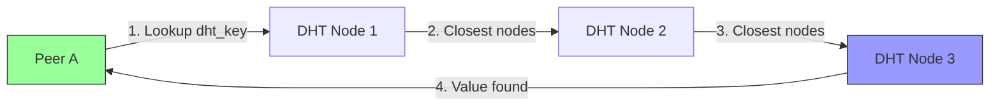

# WRAITH Protocol Network Topology

**Document Version:** 1.0.0
**Last Updated:** 2025-11-28
**Status:** Architecture Specification

---

## Overview

WRAITH employs a decentralized peer-to-peer network architecture with no central servers or authorities. The network consists of three primary components:

1. **Peers:** End nodes that transfer files
2. **DHT Network:** Distributed hash table for peer discovery
3. **Relay Network:** DERP-style relays for NAT traversal

---

## Peer-to-Peer Architecture

### Direct Connection Model

```
Peer A (Public IP)  ←──────────────→  Peer B (Public IP)
   192.0.2.10:41234                     198.51.100.50:51623

Protocol: UDP direct connection
Latency: Minimal (single hop)
Throughput: Maximum (no relay overhead)
```

**Characteristics:**
- Ideal scenario: both peers publicly routable
- No intermediaries, lowest latency
- Maximum throughput (limited only by bandwidth)
- End-to-end encrypted (Noise_XX session)

---

## NAT Traversal Topologies

### Scenario 1: Both Peers Behind NAT

```
        Internet
            │
    ┌───────┴───────┐
    │               │
  NAT A           NAT B
    │               │
  Peer A          Peer B

Solution: Relay + Hole Punching
```

**Initial Connection via Relay:**
```
Peer A → Relay (TLS) → Peer B
Peer B → Relay (TLS) → Peer A
```

**Hole Punching Sequence:**
```
1. Both peers learn their external endpoints from relay
2. Relay exchanges endpoint info
3. Simultaneous UDP probes:
   Peer A → external IP:port of Peer B
   Peer B → external IP:port of Peer A
4. PATH_CHALLENGE/PATH_RESPONSE validation
5. Migrate from relay to direct connection
```

**NAT Types and Success Rate:**
| NAT Type A | NAT Type B | Direct Connection Possible? | Relay Required? |
|------------|------------|----------------------------|-----------------|
| Full Cone | Full Cone | ✓ Yes | No |
| Full Cone | Restricted | ✓ Yes | No |
| Restricted | Restricted | ✓ Yes (simultaneous open) | No |
| Symmetric | Restricted | ~ Sometimes (birthday attack) | Fallback |
| Symmetric | Symmetric | ✗ Rare | Yes |

### Scenario 2: One Peer Public, One Behind NAT

```
Peer A (Public IP)  ←─────→  NAT  ←─────→  Peer B (Private IP)
  192.0.2.10                              10.0.0.50
```

**Connection Method:**
- Peer A connects directly to NAT's external IP
- NAT forwards to Peer B (if port mapping exists or hole punched)
- No relay required

---

## DHT Network Architecture

### Privacy-Enhanced Kademlia DHT

**Node Topology:**
```
DHT Overlay Network (Kademlia):
  - 160-bit node ID space
  - k=20 (replication factor)
  - α=3 (parallel queries)

Example DHT Routing:
Node A (0x0000...)
  ├─ Distance 2^159: Nodes in bucket 159
  ├─ Distance 2^158: Nodes in bucket 158
  │  ...
  └─ Distance 2^0: Nodes in bucket 0 (closest)
```

**Encrypted Announcements:**
```
Announcement Key Derivation:
  dht_key = BLAKE3(group_secret || content_hash || "announce")[0..20]

Storage:
  DHT stores encrypted blobs at dht_key
  Only group members can:
    1. Compute the correct key
    2. Decrypt the announcement
    3. Verify the signature
```

**Privacy Properties:**
- DHT nodes see only: ciphertext, timestamp, query patterns
- DHT nodes cannot see: content hash, peer list, group membership
- Unlinkability: Keys appear random, queries uncorrelatable

### DHT Query Path



**Query Sequence:**
1. Peer computes `dht_key = BLAKE3(group_secret || file_hash || "announce")[0..20]`
2. Initiates FIND_VALUE(dht_key) to closest known nodes
3. Receives either:
   - Value (encrypted announcement)
   - Closer nodes to query
4. Iteratively queries closer nodes until value found
5. Decrypts announcement with `HKDF(group_secret, "dht-announce")`
6. Verifies Ed25519 signature
7. Extracts peer endpoints

**Typical Latency:**
- Local network: 10-50 ms
- Internet: 100-500 ms
- Depends on: query hops (typically 4-6)

---

## Relay Network (DERP-Style)

### Relay Architecture

```
                    ┌─────────────────┐
                    │  Relay Server   │
                    │  Public IP      │
                    │  TLS Endpoint   │
                    └────────┬────────┘
                             │
              ┌──────────────┴──────────────┐
              │                             │
        TLS Connection                TLS Connection
              │                             │
       ┌──────▼──────┐               ┌──────▼──────┐
       │   Peer A    │               │   Peer B    │
       │  (NAT'd)    │               │  (NAT'd)    │
       │  10.0.0.50  │               │  10.1.0.100 │
       └─────────────┘               └─────────────┘

Note: Relay forwards encrypted blobs (cannot decrypt)
```

**Relay Components:**
1. **Accept Loop:** TLS handshake, client registration
2. **Routing Table:** PublicKey → TLS Connection
3. **Forwarding Loop:** Route encrypted frames by destination key

**Relay Protocol:**
```
Client → Relay:
  SUBSCRIBE(my_public_key)
  SEND(dest_public_key, encrypted_payload)

Relay → Client:
  RECV(src_public_key, encrypted_payload)
```

**End-to-End Encryption:**
```
Peer A encrypts with Noise_XX session
  ↓
Relay sees: [dest_pubkey | encrypted_blob]
  ↓
Relay forwards to Peer B
  ↓
Peer B decrypts with Noise_XX session
```

**Security:**
- Relay cannot decrypt payloads (end-to-end encrypted)
- Relay can observe: metadata (source IP, dest pubkey, timing, sizes)
- Relay cannot: link plaintext identities, content analysis
- Relay trust: Zero trust (assume adversarial)

### Relay Discovery

**Bootstrap Relays:**
```toml
# Default relay list (hard-coded)
relays = [
    "relay1.wraith.network:41641",
    "relay2.wraith.network:41641",
    "relay3.wraith.network:41641",
]
```

**DHT-Based Relay Discovery:**
```
Query: dht_key = BLAKE3("relay-announce-v1")
Stores: List of available relays (addresses, public keys)
Updates: Relays periodically re-announce
```

**Relay Selection:**
```rust
fn select_relay(peer_location: Location, relays: &[Relay]) -> Relay {
    // Prioritize by latency
    let mut scored: Vec<_> = relays.iter()
        .map(|r| (r, estimate_latency(peer_location, r.location)))
        .collect();

    scored.sort_by_key(|(_, latency)| *latency);
    scored[0].0.clone()
}
```

---

## Multi-Peer Topologies

### Parallel Download (Swarm)

```
        - Peer A -
       /    |    \
      /     |     \
     /      |      \
Peer S1  Peer S2  Peer S3
   │        │        │
   └────────┴────────┘
      File Chunks

Peer A downloads different chunks from S1, S2, S3 simultaneously
```

**Chunk Allocation:**
```rust
// Rarest-first algorithm (like BitTorrent)
fn select_chunk(available_chunks: &[ChunkInfo]) -> ChunkId {
    available_chunks.iter()
        .min_by_key(|c| c.peer_count)  // Rarest chunk
        .map(|c| c.chunk_id)
        .unwrap()
}
```

**Performance:**
```
Single Source:     100 Mbps
Three Sources:     ~280 Mbps (diminishing returns from overhead)
Ten Sources:       ~700 Mbps (near-linear up to this point)
```

### Group File Sharing

```
       DHT Network
            │
    ┌───────┼───────┐
    │       │       │
  Peer A  Peer B  Peer C
    │       │       │
All share group_secret
All announce to: BLAKE3(group_secret || file_hash)
```

**Workflow:**
1. Peer A has file, computes `file_hash = BLAKE3(file_content)`
2. Peer A announces to DHT at `dht_key = BLAKE3(group_secret || file_hash || "announce")`
3. Peer B wants file, queries DHT with same `dht_key`
4. Peer B discovers Peer A's endpoints (encrypted)
5. Peer B establishes Noise_XX session with Peer A
6. Transfer proceeds peer-to-peer

**Scalability:**
```
Group Size    Discovery Latency    Peer Selection Time
─────────────────────────────────────────────────────────
1-10 peers    50-100 ms            ~10 ms
10-100 peers  100-200 ms           ~50 ms
100-1000 peers 200-500 ms          ~200 ms
```

---

## Network Failure Modes

### Peer Unreachable

**Scenario:** Peer goes offline mid-transfer.

**Detection:**
- Idle timeout (30 seconds default)
- Multiple PTO (probe timeout) expirations

**Recovery:**
```
1. Mark peer as unavailable
2. Query DHT for alternative peers
3. Resume transfer from last acknowledged chunk
4. If no alternative peers, pause and retry later
```

### DHT Partition

**Scenario:** Network split isolates DHT nodes.

**Impact:**
- Queries may not find all peers
- Announcements may not propagate

**Mitigation:**
```
1. Connect to multiple DHT bootstrap nodes
2. Use multiple relay servers (different networks)
3. Fallback to manual peer addition (IP:port)
```

### Relay Failure

**Scenario:** Relay server crashes or becomes unreachable.

**Detection:**
- TLS connection closed
- Connection timeout

**Recovery:**
```
1. Attempt direct connection (if not already tried)
2. Connect to alternative relay from list
3. If all relays fail, enter offline mode
```

### Symmetric NAT Impasse

**Scenario:** Both peers behind symmetric NAT, hole punching fails.

**Outcome:**
- Direct connection impossible
- Relay required indefinitely

**Performance Impact:**
```
Direct Connection:   1000 Mbps
Via Relay:          100-500 Mbps (relay bandwidth limit)
Latency Increase:   +20-100 ms (relay hop)
```

---

## Network Metrics

### Topology Discovery Latency

| Metric | Best Case | Typical | Worst Case |
|--------|-----------|---------|------------|
| **DHT Lookup** | 50 ms | 200 ms | 2000 ms |
| **Relay Connection** | 20 ms | 100 ms | 5000 ms |
| **Hole Punch** | 10 ms | 50 ms | 500 ms (timeout) |
| **Total (cold start)** | 80 ms | 350 ms | 7500 ms |

### Connection Success Rate

```
Topology                               Success Rate
──────────────────────────────────────────────────────
Both peers public IP                   100%
One public, one NAT                    ~98%
Both NAT (cone)                        ~95%
Both NAT (restricted)                  ~90%
One/both symmetric NAT                 ~70%
Both symmetric NAT (via relay)         ~95%
```

---

## Deployment Topologies

### Home User

```
Internet ←→ Home Router (NAT) ←→ Peer Device
                                  (10.0.0.x)

Requirements:
  - DHT participation
  - Relay for incoming connections
  - UPnP/NAT-PMP for automatic port forwarding (optional)
```

### Enterprise Network

```
Internet ←→ Corporate Firewall ←→ Internal Network
                DPI/IDS             (192.168.x.x)
                                         │
                                      Peer Device

Challenges:
  - DPI filtering → Use protocol mimicry (TLS wrapper)
  - Restrictive firewall → DNS-over-HTTPS covert channel
  - NAT → Relay + hole punching
```

### Mobile Device

```
Cellular Network ←→ Carrier NAT ←→ Mobile Device
  (LTE/5G)          (Multiple layers)

Characteristics:
  - IP address changes frequently
  - Connection migration required
  - Relay-dependent
  - Power-aware (reduce cover traffic)
```

### Data Center

```
Internet ←→ Load Balancer ←→ Server Farm
                                 │
                            Peer Instances

Features:
  - Multiple public IPs
  - No NAT traversal needed
  - Can host relay servers
  - Can run DHT bootstrap nodes
```

---

## Scalability Analysis

### DHT Capacity

```
Node ID Space:    2^160 ≈ 1.46 × 10^48
Practical Limit:  ~10^9 nodes (1 billion)
Routing Hops:     log₂(N) ≈ 30 hops for 10^9 nodes
```

**With k=20 (replication):**
```
Data redundancy:  20 copies per value
Fault tolerance:  Survive 19/20 node failures
Lookup success:   >99.9% (with replication)
```

### Relay Capacity

**Single Relay Server:**
```
Hardware: 8-core CPU, 10 Gbps NIC
Concurrent Peers: ~10,000
Aggregate Bandwidth: ~5 Gbps (50% of NIC)
Latency Overhead: ~10 ms (forwarding)
```

**Relay Network:**
```
Relays Needed (1M users, 10% active):
  Active Connections: 100,000
  Connections per Relay: 10,000
  Required Relays: 10

Geographic Distribution:
  North America: 3 relays
  Europe: 3 relays
  Asia: 3 relays
  Others: 1 relay
```

### Global Deployment

```
Expected Topology (1M users):
─────────────────────────────────────
DHT Bootstrap Nodes: 20-50
Relay Servers: 10-20
Average Peers Online: ~100,000 (10%)
Direct Connections: ~60%
Relay Connections: ~40%
DHT Queries/sec: ~1,000
Bandwidth (aggregate): ~500 Gbps
```

---

## Network Optimization

### Latency Reduction

**Techniques:**
1. **Geographic Relay Selection:** Choose relay closest to peer
2. **Connection Caching:** Reuse established sessions
3. **Optimistic Direct Connection:** Attempt direct first, relay as fallback
4. **Parallel Queries:** Query multiple DHT nodes simultaneously

### Bandwidth Optimization

**Techniques:**
1. **Chunk Deduplication:** Don't re-download existing chunks
2. **Peer Selection:** Prefer high-bandwidth peers
3. **Load Balancing:** Distribute load across multiple sources
4. **Compression:** LZ4 for compressible data (optional)

### Resilience

**Techniques:**
1. **Multi-Path:** Use multiple relays simultaneously
2. **Fast Reconnect:** Resume from last checkpoint
3. **Chunk Verification:** Reject corrupted chunks early
4. **Timeout Tuning:** Adaptive based on measured RTT

---

## Conclusion

WRAITH's network topology provides:
- **Decentralization:** No single point of failure
- **Privacy:** DHT queries unlinkable, relay-blind forwarding
- **Resilience:** Multi-path connections, NAT traversal
- **Scalability:** Kademlia DHT, distributed relay network

**Trade-offs:**
- Relay adds latency (~10-100 ms) when direct connection impossible
- DHT lookups add delay (~200 ms) for cold starts
- Symmetric NAT scenarios require permanent relay use

---

**See Also:**
- [Protocol Overview](protocol-overview.md)
- [Security Model](security-model.md)
- [Embedding Guide](../integration/embedding-guide.md)
