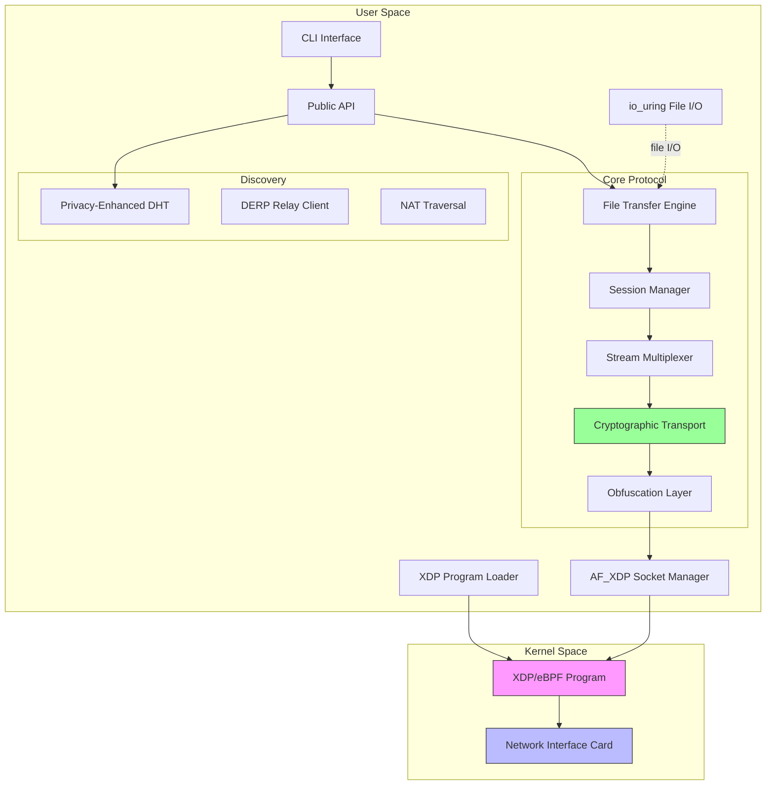
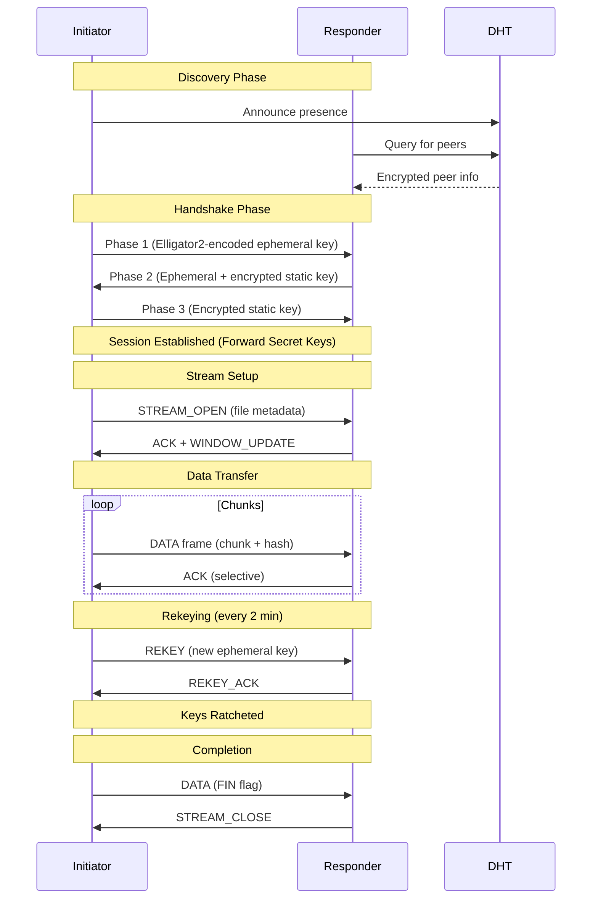

# WRAITH Protocol Overview

**Document Version:** 1.0.0
**Last Updated:** 2025-11-28
**Status:** Architecture Specification

---

## Executive Summary

WRAITH (Wire-speed Resilient Authenticated Invisible Transfer Handler) is a decentralized secure file transfer protocol designed for high-throughput (300+ Mbps), low-latency operation across all file sizes while maintaining strong security guarantees and traffic analysis resistance.

### Key Characteristics

- **Wire-Speed Performance:** 10-40 Gbps on commodity hardware via AF_XDP kernel bypass
- **Traffic Invisibility:** Computationally indistinguishable from random noise
- **Strong Cryptography:** XChaCha20-Poly1305 AEAD with forward secrecy
- **Decentralized Architecture:** Privacy-enhanced DHT, no central servers
- **Zero-Trust Design:** End-to-end encryption, mutual authentication
- **Resilient Transport:** Tolerates packet loss, reordering, NAT traversal

---

## Design Philosophy

### Core Principles

**1. Security by Default**
- All communications encrypted and authenticated
- Forward secrecy through continuous key ratcheting
- Post-compromise security via DH ratchet
- No plaintext metadata leakage

**2. Indistinguishability by Design**
- Elligator2-encoded key exchange (appears random)
- AEAD-encrypted payloads with random padding
- Protocol mimicry (HTTPS, WebSocket, DNS-over-HTTPS)
- Timing obfuscation and cover traffic

**3. Performance Without Compromise**
- Kernel bypass via AF_XDP and XDP/eBPF
- Zero-copy packet processing with io_uring
- BBRv2 congestion control for bandwidth maximization
- Thread-per-core architecture, NUMA-aware allocation

**4. Decentralization**
- No single point of failure or control
- Privacy-enhanced DHT for peer discovery
- DERP-style relays for NAT traversal (end-to-end encrypted)
- Any peer can relay, discover, or transfer

---

## Architecture Overview

### Six-Layer Protocol Stack

```
┌─────────────────────────────────────────────────────────────────────────┐
│                        Application Layer                                │
│   File Transfer API │ Chunk Management │ Integrity Verification         │
├─────────────────────────────────────────────────────────────────────────┤
│                        Session Layer                                    │
│   Stream Multiplexing │ Flow Control │ Congestion Control               │
├─────────────────────────────────────────────────────────────────────────┤
│                        Cryptographic Transport Layer                    │
│   Noise_XX Handshake │ AEAD Encryption │ Key Ratcheting                 │
├─────────────────────────────────────────────────────────────────────────┤
│                        Obfuscation Layer                                │
│   Elligator2 Encoding │ Traffic Shaping │ Padding │ Timing Jitter       │
├─────────────────────────────────────────────────────────────────────────┤
│                        Kernel Acceleration Layer                        │
│   AF_XDP Sockets │ XDP Programs │ io_uring │ Zero-Copy DMA              │
├─────────────────────────────────────────────────────────────────────────┤
│                        Network Layer                                    │
│   UDP │ Raw Sockets │ ICMP Covert Channels │ DNS Tunneling              │
└─────────────────────────────────────────────────────────────────────────┘
```

### Component Architecture



---

## Core Components

### 1. Application Layer

**Purpose:** High-level file transfer abstractions and integrity verification.

**Responsibilities:**
- File chunking (default: 256 KiB chunks)
- BLAKE3 tree hashing for integrity
- Transfer state management (pause, resume, cancel)
- Progress reporting and error handling
- Multi-peer parallel downloads

**Key Features:**
- Seek/random access support
- Sparse file handling
- Resumable transfers after disconnection
- Chunk deduplication across files

### 2. Session Layer

**Purpose:** Connection management, stream multiplexing, and resource allocation.

**Responsibilities:**
- Session lifecycle (handshake → established → close)
- Stream multiplexing (up to 16,384 streams per session)
- Flow control (per-stream and connection-level windows)
- Congestion control (BBRv2 algorithm)
- Loss detection and retransmission

**Key Features:**
- Connection migration (IP/port changes without re-handshake)
- Stateless reset for unknown connections
- Graceful shutdown with drain period
- Path validation before migration

### 3. Cryptographic Transport Layer

**Purpose:** Authenticated encryption and forward secrecy.

**Algorithm Suite:**
| Function | Algorithm | Security |
|----------|-----------|----------|
| Key Exchange | X25519 | 128-bit |
| AEAD | XChaCha20-Poly1305 | 256-bit key, 128-bit auth |
| Hash | BLAKE3 | 128-bit collision resistance |
| KDF | HKDF-BLAKE3 | 128-bit |
| Signatures | Ed25519 | 128-bit (identity only) |

**Security Properties:**
- **Confidentiality:** IND-CPA secure encryption
- **Integrity:** INT-CTXT authentication
- **Forward Secrecy:** Ephemeral DH + symmetric ratchet
- **Post-Compromise Security:** DH ratchet every 2 minutes or 1M packets
- **Replay Protection:** Nonce + sliding window
- **Mutual Authentication:** Noise_XX pattern

### 4. Obfuscation Layer

**Purpose:** Traffic analysis resistance and censorship evasion.

**Techniques:**
1. **Elligator2 Key Encoding:** Public keys indistinguishable from random
2. **Packet Padding:** 6 size classes (64B to 8960B) with random selection
3. **Timing Obfuscation:** Exponential delays, burst shaping
4. **Cover Traffic:** PAD frames during idle periods
5. **Protocol Mimicry:** HTTPS/TLS, WebSocket, DNS-over-HTTPS wrappers

**Modes:**
- **Performance:** Minimal padding, low latency
- **Privacy:** Random padding, moderate delays
- **Stealth:** HTTPS mimicry, traffic shaping to match patterns

### 5. Kernel Acceleration Layer

**Purpose:** High-performance packet I/O bypassing kernel network stack.

**Technologies:**
- **XDP/eBPF:** Packet filtering at NIC driver level (26M pps drop rate)
- **AF_XDP:** Zero-copy userspace packet delivery
- **io_uring:** Async file I/O with zero-copy support
- **UMEM:** Shared memory region for DMA (huge pages)

**Performance Benefits:**
- 10-40 Gbps throughput on commodity hardware
- Sub-millisecond latency (NIC to userspace < 1μs)
- CPU efficiency through batching and zero-copy
- NUMA-aware memory allocation

### 6. Network Layer

**Purpose:** Underlying transport protocols.

**Supported Transports:**
1. **UDP (Primary):** Low latency, connection-less
2. **Raw Sockets:** Custom protocol headers (requires privileges)
3. **ICMP Covert Channels:** Steganography in ping packets
4. **DNS Tunneling:** DoH queries (100-500 bytes/query)

---

## Data Flow

### Typical File Transfer Sequence



### Packet Processing Pipeline

```
Incoming Packet Flow:
NIC → XDP Program (filter by CID) → AF_XDP Socket → UMEM Buffer
  → Userspace Worker → Decrypt (AEAD) → Parse Frame
  → Route to Session → Route to Stream → Deliver to Application
  → Integrity Check → Write to File (io_uring)

Outgoing Packet Flow:
Application → Read File (io_uring) → Hash Chunk → Build Frame
  → Queue to Session → Congestion Control → Encrypt (AEAD)
  → Add Padding → Obfuscation Layer → UMEM Buffer
  → AF_XDP Socket → XDP Program → NIC
```

---

## Performance Characteristics

### Throughput Targets

| Network Type | Target Throughput | Latency |
|--------------|-------------------|---------|
| Gigabit Ethernet | 300-900 Mbps | 1-5 ms |
| 10 Gigabit | 3-9 Gbps | 0.5-2 ms |
| 40 Gigabit | 10-35 Gbps | 0.3-1 ms |
| WiFi 6 | 100-400 Mbps | 5-20 ms |
| LTE/5G | 10-100 Mbps | 20-100 ms |

### Resource Requirements

**Minimum:**
- CPU: 2 cores (2.0 GHz+)
- RAM: 512 MB
- Linux Kernel: 5.15+ (for basic UDP)

**Recommended:**
- CPU: 4+ cores (3.0 GHz+)
- RAM: 2 GB+
- Linux Kernel: 6.2+ (for AF_XDP)
- NIC: Driver with XDP support

**High-Performance:**
- CPU: 8+ cores (3.5 GHz+), NUMA topology
- RAM: 16 GB+ (huge pages)
- Linux Kernel: 6.6+
- NIC: Intel i40e, Mellanox mlx5 (native XDP)
- Direct NIC attachment (no virtual networking)

---

## Security Model

### Threat Model

**In Scope:**
- Passive network observers (ISPs, nation-states)
- Active network attackers (MITM, packet injection)
- Malicious DHT nodes
- Compromised relay servers
- Traffic analysis attacks
- Censorship circumvention

**Out of Scope:**
- Endpoint compromise (malware on peer devices)
- Global passive adversary (full network observation)
- Cryptographic primitive breaks
- Side-channel attacks on implementation
- Social engineering

### Security Guarantees

1. **Confidentiality:** Plaintext content never exposed on network
2. **Integrity:** Tampering detected via authentication tags
3. **Authenticity:** Peers mutually authenticated via Noise_XX
4. **Forward Secrecy:** Past sessions secure even if current keys compromised
5. **Anonymity (Limited):** Traffic correlation difficult but not impossible
6. **Deniability (Limited):** Static keys provide proof of communication

### Attack Resistance

| Attack Vector | Mitigation | Effectiveness |
|---------------|------------|---------------|
| Passive Eavesdropping | AEAD encryption | Complete protection |
| Active MITM | Mutual authentication | Complete protection |
| Replay Attack | Nonce + sliding window | Complete protection |
| Traffic Analysis | Padding + timing + mimicry | Best-effort obfuscation |
| DPI Filtering | Elligator2 + mimicry | High resistance |
| DHT Poisoning | Encrypted announcements + signatures | High resistance |
| Relay Surveillance | End-to-end encryption | Complete protection |

---

## Comparison with Existing Protocols

### vs. QUIC

| Feature | WRAITH | QUIC |
|---------|--------|------|
| **Encryption** | XChaCha20-Poly1305 | ChaCha20-Poly1305 / AES-GCM |
| **Handshake** | Noise_XX (3-RTT) | TLS 1.3 (1-RTT) |
| **Forward Secrecy** | Continuous ratchet | TLS session resumption |
| **Traffic Obfuscation** | Yes (Elligator2, mimicry) | No |
| **Kernel Bypass** | AF_XDP (optional) | No |
| **Decentralized** | Yes (DHT) | No |
| **NAT Traversal** | DERP + hole punching | STUN |

**WRAITH Advantages:** Stealth, decentralization, extreme performance
**QUIC Advantages:** Faster handshake, ubiquitous deployment, HTTP/3 integration

### vs. WireGuard

| Feature | WRAITH | WireGuard |
|---------|--------|-----------|
| **Purpose** | File transfer | VPN tunnel |
| **Handshake** | Noise_XX | Noise_IK (1-RTT) |
| **Connection Model** | Session-based | Stateless |
| **Stream Multiplexing** | Yes (16K streams) | No |
| **Congestion Control** | BBRv2 | Kernel TCP stack |
| **Traffic Obfuscation** | Yes | No |

**WRAITH Advantages:** Application-layer features, obfuscation, session management
**WireGuard Advantages:** Simpler protocol, faster handshake, mature deployment

### vs. BitTorrent

| Feature | WRAITH | BitTorrent |
|---------|--------|------------|
| **Encryption** | Mandatory (AEAD) | Optional (MSE/PE) |
| **Forward Secrecy** | Yes | No |
| **Traffic Visibility** | Indistinguishable from random | Identifiable patterns |
| **Discovery** | Private DHT | Public DHT |
| **Relay** | Yes (encrypted) | No |

**WRAITH Advantages:** Privacy, security, stealth
**BitTorrent Advantages:** Massive peer pools, torrent ecosystem

---

## Use Cases

### Primary Use Cases

1. **Secure P2P File Sharing**
   - Transfer large files between trusted parties
   - Resume after network interruptions
   - Parallel downloads from multiple sources

2. **Privacy-Conscious Communication**
   - Journalists sharing sensitive documents
   - Whistleblowers transferring evidence
   - Activists evading surveillance

3. **Censorship Circumvention**
   - Protocol mimicry defeats DPI filtering
   - DNS tunneling when UDP blocked
   - Relay network for restricted networks

4. **Backup/Sync Services**
   - Encrypted peer-to-peer backup
   - No cloud provider access to data
   - Efficient delta synchronization

5. **IoT/Edge Computing**
   - Secure sensor data aggregation
   - Firmware updates over mesh networks
   - Low-latency command distribution

### Client Applications (Planned)

1. **WRAITH-Chat:** Secure messaging with E2EE
2. **WRAITH-Transfer:** Direct P2P file transfer
3. **WRAITH-Share:** Distributed anonymous file sharing
4. **WRAITH-Stream:** Encrypted media streaming
5. **WRAITH-Sync:** Cloud-less backup synchronization
6. **WRAITH-Mesh:** IoT mesh networking
7. **WRAITH-Publish:** Censorship-resistant publishing
8. **WRAITH-Vault:** Distributed secret storage

---

## Design Rationale

### Why UDP?

- **Low Latency:** No TCP head-of-line blocking
- **Control:** Application-level congestion control (BBR)
- **Efficiency:** No kernel overhead for reliability
- **Flexibility:** Custom loss recovery strategies

### Why Noise_XX?

- **Mutual Authentication:** Both peers verify each other
- **Identity Hiding:** Static keys encrypted during handshake
- **Simplicity:** Well-studied, formally verified protocol
- **Flexibility:** Pattern supports post-quantum upgrades

### Why Elligator2?

- **Indistinguishability:** Keys appear uniformly random
- **Simplicity:** Efficient inverse map for Curve25519
- **Compatibility:** Works with X25519 key exchange
- **Effectiveness:** Defeats statistical analysis

### Why AF_XDP?

- **Performance:** 10-40 Gbps on commodity hardware
- **Latency:** Sub-microsecond NIC-to-userspace
- **Efficiency:** Zero-copy reduces CPU/memory overhead
- **Control:** Full packet processing in userspace
- **Compatibility:** Standard Linux kernel feature (6.0+)

---

## Future Directions

### Protocol Evolution

1. **Post-Quantum Cryptography**
   - Hybrid X25519 + Kyber KEM
   - Noise framework supports PQ upgrades
   - Backward compatibility via version negotiation

2. **Multipath Transport**
   - Simultaneous use of multiple interfaces
   - Per-path congestion control
   - Seamless failover

3. **UDP-over-TCP Tunneling**
   - Fallback for UDP-blocked networks
   - HTTP/2 or HTTP/3 as carrier
   - Minimal performance penalty

4. **Enhanced Obfuscation**
   - Machine learning for traffic pattern matching
   - Adaptive mimicry based on network environment
   - Steganography in multimedia protocols

### Ecosystem Development

1. **Reference Implementations**
   - Rust (primary, high-performance)
   - Go (portable, simpler deployment)
   - Python (rapid prototyping, research)

2. **Platform Support**
   - Linux (primary, full feature set)
   - macOS (BSD kqueue, lower performance)
   - Windows (limited, no AF_XDP)
   - Android/iOS (mobile networking)

3. **Integration**
   - File manager plugins
   - Browser extensions
   - Cloud storage adapters
   - P2P application framework

---

## Conclusion

WRAITH represents a modern approach to secure file transfer, combining:
- Military-grade cryptography
- State-of-the-art performance optimization
- Traffic analysis resistance
- Decentralized architecture

The protocol is designed for a future where privacy, security, and censorship resistance are paramount, while maintaining the performance necessary for practical adoption.

---

**Next Steps:**
- Review [Layer Design](layer-design.md) for detailed component specifications
- See [Security Model](security-model.md) for threat analysis
- Consult [Performance Architecture](performance-architecture.md) for optimization details
